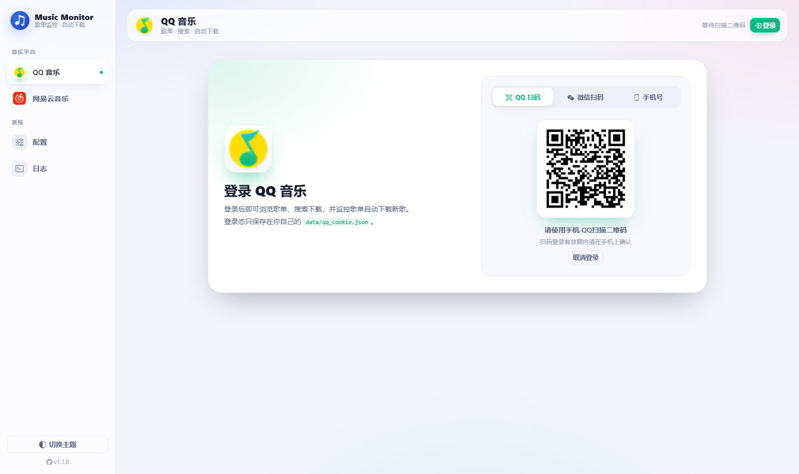
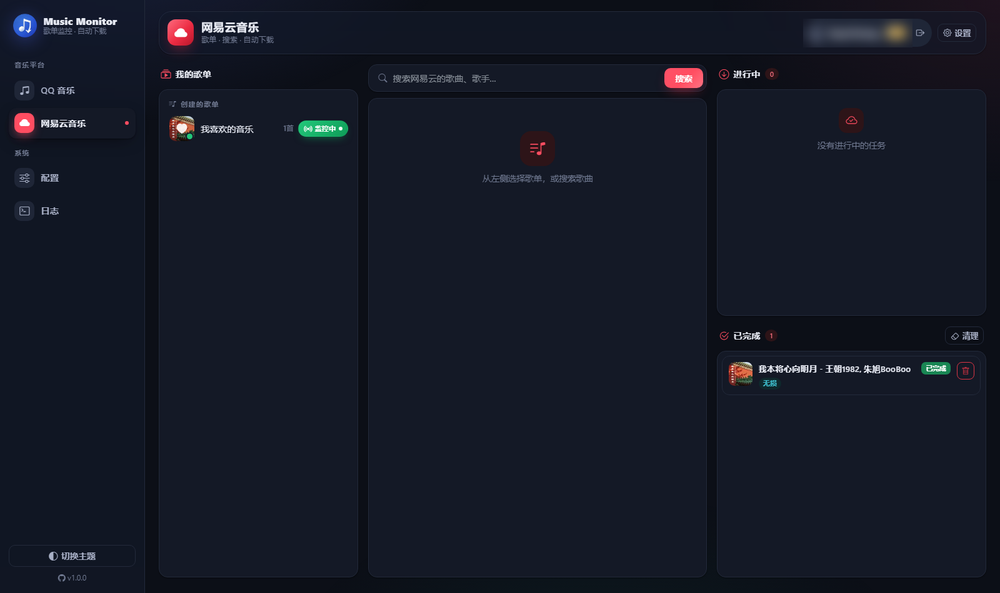

# Music Monitor · 音乐歌单监控下载器

> 本项目基于 **[huohen92/QQMusic-monitor](https://github.com/huohen92/QQMusic-monitor)** 进行二次开发，
> 在其 QQ 音乐下载与歌单监控能力的基础上，**新增网易云音乐支持，并重做了整体界面**。
> 感谢原作者及其上游项目的贡献，详见文末「致谢与项目来源」。

一个自托管的音乐下载与歌单监控工具：在网页上登录 **QQ 音乐 / 网易云音乐**，浏览歌单、搜索、在线试听、下载，
并能**监控歌单，有新歌时自动下载**，自动写入标签、封面和歌词。适合部署在 NAS 或家用服务器上。

> **当前版本：v1.1.0** ｜ 更新记录见 [CHANGELOG.md](CHANGELOG.md)

## 📷 界面预览



| 网易云音乐 · 深色 | 手机端 |
|---|---|
|  |  |

## ✨ 功能特性

### 双平台
| | QQ 音乐 | 网易云音乐 |
|---|---|---|
| 登录 | QQ 扫码 / 微信扫码 / 手机号验证码 | 扫码 / **手机号（验证码或密码）** / Cookie |
| 歌单 | 自建 + 收藏 + 我喜欢 | 创建 + 收藏 + 我喜欢的音乐 |
| 搜索、试听、单曲 / 整单下载 | ✅ | ✅ |
| 歌单监控，自动下载新歌 | ✅ | ✅ |
| 音质 | 自动取最高：母带 → 全景声 → FLAC → … | 自动取最高：超清母带 → Hi-Res → 无损 → …（按账号权益降档） |
| 标签 / 封面 / 歌词 / .lrc | ✅ | ✅（沿用同一套开关） |

### 网易云登录与风控
网易云对服务器 IP 风控很严，扫码或短信经常返回 `-462 / 8821`。本项目做了**多通道自动切换**：
- 依次尝试**网页端 (weapi)**、**PC 客户端 (eapi)** 和**安卓客户端 (eapi)** 三套接口；某个通道被风控时，自动换下一个。
- 手机号登录支持**短信验证码**和**密码**两种方式。
- 三个通道都被拦截时，可以改用 **Cookie 登录**（粘贴浏览器里的 `MUSIC_U`），这种方式一定可用。
- 登录态保存在 `data/ncm_cookie.json`，重启无需重新登录。登录失效时会推送通知。

> 加密算法（weapi / eapi）为自行实现，不依赖已从 PyPI 下架的第三方网易云库，只用到 `httpx` 和 `cryptography`。

### 下载与本地文件
- 「本地已存在」按**目标目录的实际文件**判断，命中就跳过，不浪费每日额度。本地已有的歌可以一键覆盖重下。
- 歌单下载默认保存到 `/app/downloads/<歌单名>`；在「配置」里关闭「按歌单名建子文件夹」后，所有歌都平铺保存到 `/app/downloads`。每个监控歌单也能单独设置目录，QQ 歌单还能按日期建子文件夹。
- 可以取消排队中或正在下载的任务，半成品文件会自动清理。也支持失败重试、批量操作。
- 文件先写成 `.part`，下载完成后再改名，中途断掉也不会留下损坏的文件。

### 界面（v1.0 重做）
- **侧边导航 + 平台主题色**：QQ 音乐是翠绿，网易云是中国红，按钮、高亮、播放条都跟着当前平台变色。
- **浅色 / 深色 / 跟随系统** 三种主题，整屏淡入淡出切换，首屏不闪白。
- 两个平台**共用一个底部悬浮播放条**：通栏进度可拖动、显示缓冲状态、记住音量，播放中的歌曲行会有均衡器动效。音频由服务端代理转发，支持 Range 请求。
- 加载时显示骨架屏，空状态有插画，操作结果用轻提示（Toast），设置放在右侧抽屉，危险操作用统一的确认对话框。
- 歌曲列表可以就地筛选；地址栏 `#music / #netease / #config / #logs` 能直接定位到对应页面，刷新后停留在原页。
- **手机端**：侧栏变成底部标签栏，歌曲行改成卡片式，播放条悬浮在标签栏上方，适配 iPhone 安全区。
- 快捷键：`空格` / `K` 播放暂停，`←` / `→` 快退快进 5 秒。

### 统一配置
- 一个配置页管理两个平台，分成「下载 / 保存位置 / 标签与歌词 / 歌单监控 / 通知」五组卡片，顶部有快速跳转，底部有悬浮的保存栏。
- 并发数调整后**立即生效**：增加时马上补足工作者；减少时空闲的工作者先退出，正在下载的会把当前这首下完，不会被打断。
- 从 v1.0 升级时，旧的 `data/ncm_config.json` 会自动合并进 `config.json`，合并后改名为 `ncm_config.json.migrated`。

### 通知与日志
- 支持企业微信机器人、Bark、自定义 Webhook，推送下载成功、下载失败、歌单更新、歌单下载结果汇总、登录失效等事件。网易云的通知会带上 `[网易云]` 前缀。
- 内置日志页（保留最近 3000 条），可以只看警告和错误。

## 📦 飞牛 fnOS 应用包（fpk）

在飞牛 NAS 上可以把它作为原生应用安装，跟其它应用一样在「应用中心」里启动、设置和卸载：

```bash
# 在 NAS 上（需要 Docker 与飞牛自带的 fnpack）
git clone https://github.com/yiyu12138/Music-monitor.git
cd Music-monitor
bash fpk/build.sh          # 产出 music-monitor_<版本>_x86.fpk（约 90MB，已内置镜像）
```

然后打开飞牛「应用中心」→「手动安装」，选择生成的 `.fpk`，按向导填写访问端口（默认 6696）、音乐保存目录（默认 `/vol1/1000/music`）、应用数据目录与时区即可。

- 安装后可在应用设置里改端口和目录，保存后容器会自动按新配置重建。
- 内置了 Docker 镜像，安装时不需要联网构建。
- 卸载会删除容器和镜像，但**不会删除数据目录和音乐目录**。
- 打包细节与目录说明见 [fpk/README.md](fpk/README.md)。
- 从手动 Docker 部署迁移：把原来的 `data/` 内容拷进 `/var/apps/music-monitor/shares/data`，登录态与监控配置都能保留；装之前先 `docker rm -f music-monitor`，避免端口和容器名冲突。

## 🚀 Docker 部署

### 方式一：从源码构建（推荐）

```bash
git clone https://github.com/yiyu12138/Music-monitor.git
cd Music-monitor
docker compose up -d --build
```

浏览器打开 `http://<服务器IP>:6696`。仓库自带的 `docker-compose.yml` 已经把 `./data` 和 `./downloads` 映射到当前目录。

### 方式二：docker run

```bash
docker build -t music-monitor:1.1.0 .
docker run -d \
  --name Music-monitor \
  --restart unless-stopped \
  -p 6696:6696 \
  -e TZ=Asia/Shanghai \
  -v $(pwd)/data:/app/data \
  -v $(pwd)/downloads:/app/downloads \
  music-monitor:1.1.0
```

### 目录说明

| 挂载目录 | 容器路径 | 作用 |
|---|---|---|
| `./data` | `/app/data` | 两个平台的登录凭证、设备指纹、配置、任务历史、监控歌单 |
| `./downloads` | `/app/downloads` | 下载的音乐文件（可以直接挂 NAS 上已有的音乐目录） |

> ⚠️ `data/` 里有登录凭证（`qq_cookie.json`、`ncm_cookie.json`）和设备指纹，**不要分享，也不要提交到代码库**（`.gitignore` 已经排除）。

### 从 huohen92/QQMusic-monitor 迁移

`data/` 目录结构完全兼容，原来的 QQ 登录态、监控歌单、任务历史都能直接沿用。把原来的 `data/` 和下载目录挂到新容器上就行。
如果原来 compose 里用 `- ./xxx.py:/app/xxx.py` 挂载了单个源码文件，**迁移前请删掉这些挂载**，否则会覆盖新版代码。

## 📖 使用说明

1. 从左侧（手机端是底部）切换到 **QQ 音乐** 或 **网易云音乐**。
2. 登录：
   - QQ：右上角「登录」，可以选 QQ 扫码、微信扫码或手机号。
   - 网易云：页面中央的登录卡片，可以选扫码、手机号或 Cookie。扫码被风控时，切到手机号或 Cookie 即可。
3. 点开歌单查看歌曲，可以试听、单曲下载或「全部下载」（本地已有的会跳过）。
4. 点歌单旁边的「监控」，之后这个歌单新加的歌会自动下载。
5. 两个平台的设置都在「配置」页，同类项合并：并发数、保存位置、标签与歌词、监控间隔、通知都是共用的一份；监控歌单的单独目录和「按日期」也在同一张表里。
6. 下载音质无需设置，两个平台都自动下载账号能拿到的最高音质。
7. 所有设置**保存后立即生效**（包括并发数与监控间隔），无需重启容器。配置页里可以「立即检查」监控歌单，也可以「发送测试」通知。

## ⚠️ 注意事项

- **QQ 音乐**：单个账号每天的下载量有限制（约 190 首），超出后任务会自动进入冷却并重试。账号的登录设备数也有限，请保持 `data/device.json` 持久化。
- **网易云音乐**：VIP 歌曲需要会员账号才能下完整版，否则任务会提示「仅能获取试听片段」；无版权的歌无法下载。
- **不要用多 worker 启动**：任务状态保存在进程内存里，`--workers` 会导致状态不一致。
- 时区依赖 `TZ=Asia/Shanghai`（用于按日期建文件夹）。

## 🧰 常见问题

**网易云扫码 / 短信提示「当前网络被风控」？**
这是网易云针对服务器 IP 的风控。可以稍等一段时间再试，或者切到 **Cookie** 方式：浏览器登录 `music.163.com` → F12 → 应用 / Application → Cookie → 复制 `MUSIC_U` 粘贴进来。

**启动报 `Conflict. The container name ... is already in use`？**
说明已经存在同名容器。先备份 `docker cp <旧容器>:/app/data/. ./data/`，再 `docker rm -f <旧容器>`，然后重新 `docker compose up -d`。

**端口被占用？**
把 compose 里宿主机侧的端口改掉即可，比如 `"8669:6696"`。

**找不到下载的音乐？**
确认 `/app/downloads` 挂载到了你期望的目录。歌单下载默认保存在 `<下载目录>/<歌单名>/`。

## 🔨 本地开发

```bash
pip install -r requirements.txt
python -m uvicorn main:app --host 0.0.0.0 --port 6696
```

## 📁 模块说明

| 文件 | 作用 |
|---|---|
| `main.py` | FastAPI 入口与 QQ 音乐的全部接口，挂载网易云路由 |
| `qq_music.py` | 封装 `qqmusic-api-python`：登录、歌单、搜索、歌词、播放链接 |
| `netease_api.py` | **网易云接口客户端**：weapi / eapi 加密、三通道风控切换、扫码 / 手机号 / Cookie 登录 |
| `netease_app.py` | **网易云业务模块**：歌单、搜索、播放代理、下载队列、歌单监控（`/api/ncm/*`），配置与 QQ 共用 `config.json` |
| `tasks.py` / `monitor.py` | QQ 音乐下载队列与歌单监控（检查间隔两个平台共用） |
| `worker_pool.py` | 可在运行中调整并发数的下载工作者池（两个平台共用） |
| `notification.py` | 企业微信 / Bark / Webhook 通知 |
| `config.py` / `download_paths.py` / `local_files.py` | 配置、下载目录规则、本地文件检索 |
| `tagging.py` | 标签、封面、歌词写入（两个平台共用） |
| `log_store.py` | 日志环形缓冲 |
| `templates/index.html` · `static/style.css` | 页面骨架与设计系统（浅 / 深主题、平台色、响应式） |
| `static/script.js` · `static/netease.js` | QQ 音乐页逻辑（含共用播放条、对话框、主题、路由） · 网易云页逻辑 |

## 📄 License

本项目仅供个人学习与备份使用，请遵守 QQ 音乐、网易云音乐的用户协议及相关法律法规，请勿用于商业用途或大规模分发。

## 🙏 致谢与项目来源

**本项目源自 [huohen92/QQMusic-monitor](https://github.com/huohen92/QQMusic-monitor) 的二次开发。** 在原项目 v0.9.3 的基础上，本仓库：

- 新增**网易云音乐**全套功能（三种登录方式与风控通道切换、歌单、搜索、试听代理、下载、监控、设置）；
- **重做了整体界面**（侧边导航、平台主题色、悬浮播放条、骨架屏、Toast、设置抽屉、移动端底部标签栏）；
- 修复和优化了若干问题（详见 [CHANGELOG.md](CHANGELOG.md)）。

原项目及其上游：

- **[huohen92/QQMusic-monitor](https://github.com/huohen92/QQMusic-monitor)**：本项目的直接来源（QQ 音乐下载、监控、通知、标签、日志等全部基础功能）
- **[Inrrs/QQMusic-monitor](https://github.com/Inrrs/QQMusic-monitor)**：最初的 Web 框架：登录、歌单浏览、下载队列、歌单监控、通知
- **[L-1124/QQMusicApi](https://github.com/L-1124/QQMusicApi)**（`qqmusic-api-python`）：QQ 音乐 API 核心库
- **[xhongc/music-tag-web](https://github.com/xhongc/music-tag-web)**：标签写入思路，基于 [mutagen](https://mutagen.readthedocs.io/) 实现
